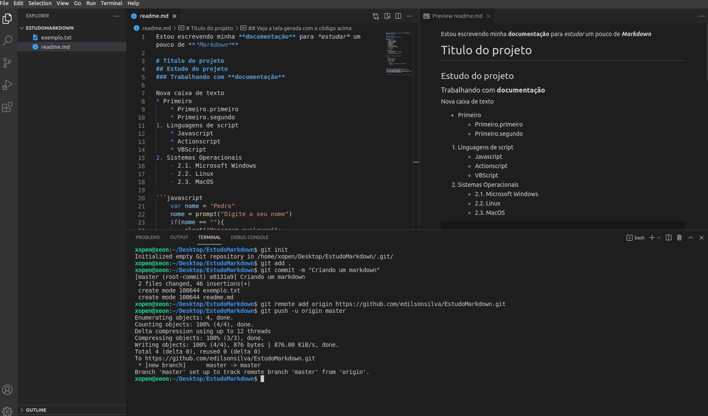

Estou escrevendo minha **documentação** para *estudar* um pouco de ***Markdown***

# Titulo do projeto
## Estudo do projeto
### Trabalhando com **documentação**

Nova caixa de texto
* Primeiro
    * Primeiro.primeiro
    * Primeiro.segundo
1. Linguagens de script
    * Javascript
    * Actionscript
    * VBScript
2. Sistemas Operacionais
    - 2.1. Microsoft Windows
    - 2.2. Linux
    - 2.3. MacOS

```javascript
    var nome = "Pedro"
    nome = prompt("Digite o seu nome")
    if(nome == ""){
        alert("Mensagem qualquer");
    }
```
### Abaixo o código de um arquivo C++

```c++
    #include <iostream>
    using std::cout;
    using std::cin;
    using std::endl;

    int main(){
        cout << "Olá. Seja bem-vindo "<< endl;
        return 0;
    }

```

## Veja a tela gerada com o código acima


## Veja o resultado do estudo Markdown
